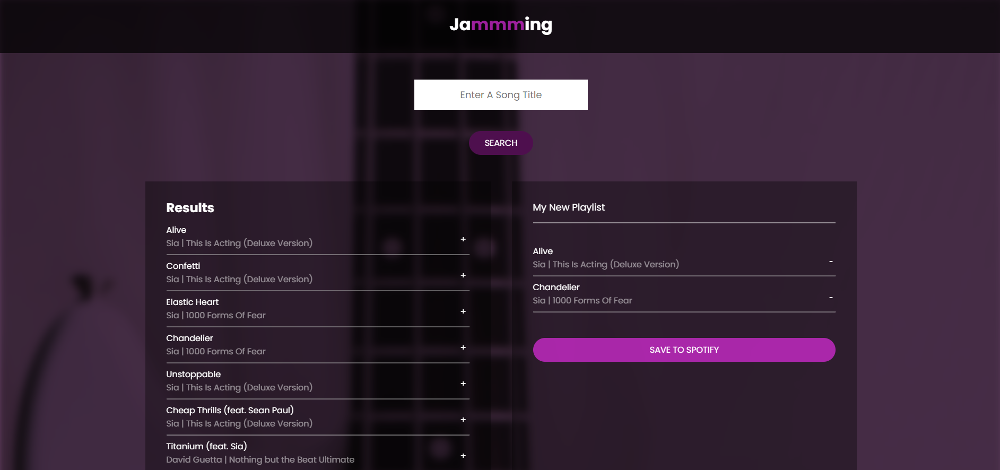

# Jammming

A playlist creator that utilises the [Spotify API](https://developer.spotify.com/documentation/web-api) to search for tracks, add them to a playlist, and save them to your Spotify account directly.

## Codecademy

Created with the Codecademy course over 2 days on 3rd/4th August 2024.

